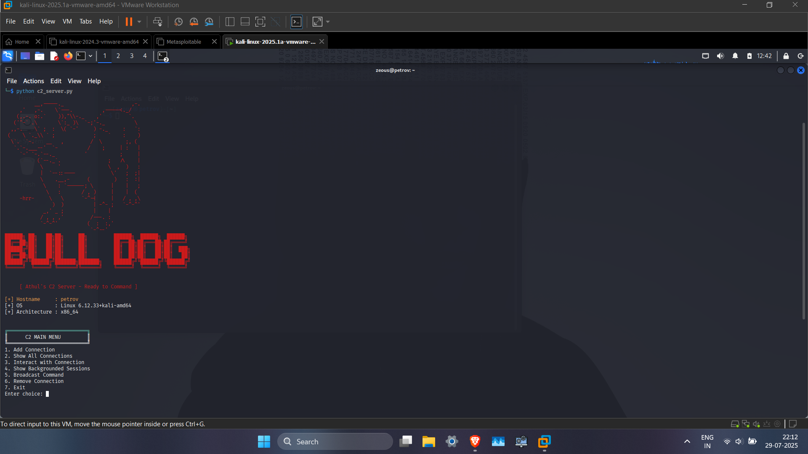

#  🐶Bulldog  C2


A lightweight, terminal-based Command & Control (C2) framework built in Python for red team operations, offering reliable shell interaction, multi-session support, broadcasting, and stealth features.

---

## 🚀 Features

### ✅ Server-Side (Attacker):

* 🎮 Interactive shell access to multiple clients
* 🔄 Backgrounding of sessions (for later use)
* 🌐 Broadcast commands to one or more clients
* 🧼 Graceful connection removal
* 🔐 Thread-safe connection management

### ✅ Client-Side (Victim):

* 🎧 Bind Shell that listens on a predefined port
* 🧠 Smart `cd` support to change directories
* 🔁 Robust reconnect loop after crash or disconnect
* 🔄 Restart-proof via systemd + `.bashrc` fallback
* 💬 Command execution with stdout/stderr feedback

---

## 📁 Project Structure

```bash
.
├── c2_server.py         # C2 server with full menu interface
├── c2_client.py         # Bind shell client that listens for attacker connection
├── bonus.md             # Instructions for persistence setup
└── README.md            # You're reading it!
```

---

## ⚙️ How to Use

### 1. Start the Client (Victim Machine)

Run the bind shell client on the victim:

```bash
python3 c2_client.py
```

Or set it up with persistence (see `bonus.md`):

* via `systemd`
* via `.bashrc`

### 2. Launch the Server (Attacker Machine)

```bash
python3 c2_server.py
```

Follow the interactive menu to:

* Add a connection
* Interact with sessions
* Broadcast commands

---

## 🧠 Notes

* Default port: `4444` (can be customized)
* Ensure both machines are on the same network (or port-forwarded)
* This framework is for **educational/red team lab use only**

---

## ✍️ Author

**Athul M**
💻 Aspiring Red Teamer | Cybersecurity Enthusiast

---

## ⚠️ Disclaimer

This tool is intended **strictly for educational purposes** and lawful red team simulation in controlled environments.

Use responsibly. You are the only one responsible for how you use it.

---

## 📜 License

MIT License
